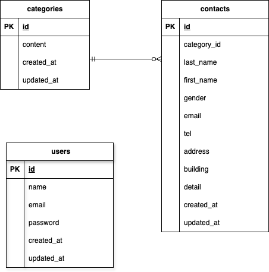

# FashionablyLate

## Dockerビルド
git@github.com:mana1218/test-form.git
cd test-form
docker-compose up -d --build

## Laravel環境構築
・docker-compose exec php bash
・composer install
・cp .env.example .env,環境変数を適宜変更
・php artisan key:generate
・php artisan migrate
・php artisan db:seed

## 開発環境
・お問い合わせ画面：http://localhost/
・ユーザー登録：http://localhost/register
・ログイン：http://localhost/login
・管理画面：http://localhost/admin
・phpMyAdmin：http://localhost:8080/

## 使用技術（実行環境）
・PHP 8.2.11
・Laravel 8.83.8
・MySQL 8.0.26
・nginx 1.21.1
・jQuery 3.7.1

## ER図
